## [Evans et al. (2020)](https://doi.org/10.1016/j.cogpsych.2020.101292)

```{r, echo=F, out.width="90%", fig.align="center"}
library(knitr)
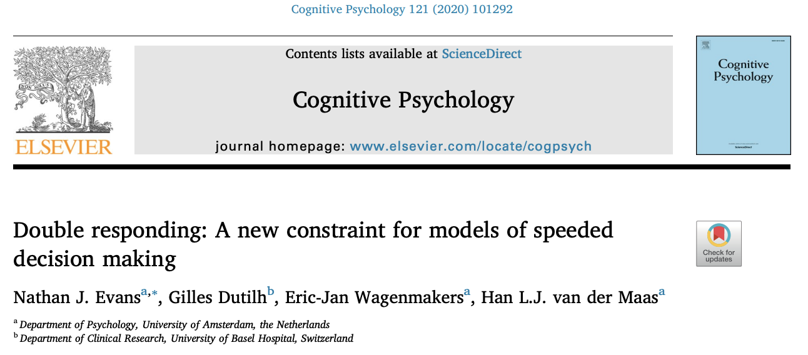
```

## Racing Diffusion Model (RDM)
- Process of choosing between N alternatives $\rightarrow$ N racing evidence accumulators

- Assumptions:

  - One threshold level of evidence
  - Random uniform distribution of starting evidence
  - Drift rate for each alternative
  - Non-decision time

\hfill
```{r, echo=F, out.width="70%", fig.align="center"}
library(knitr)
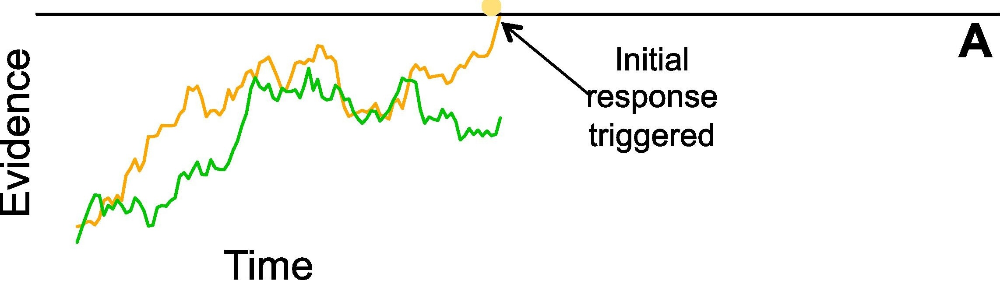
```


## What is a double response (DR)?
```{r, echo=F, out.width="70%", fig.align="center"}
library(knitr)
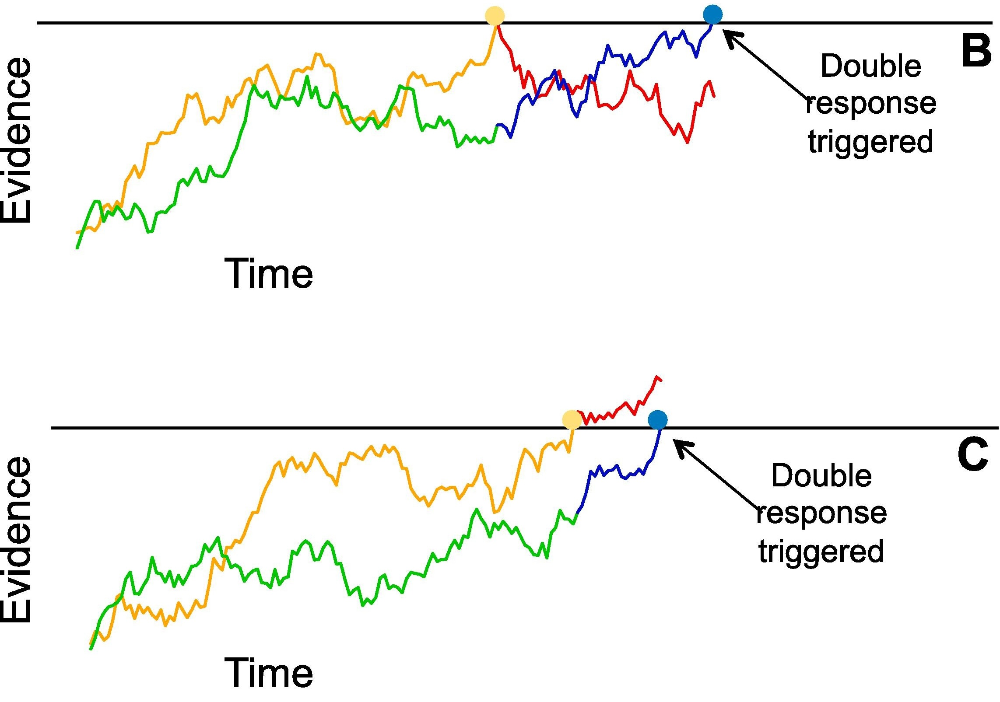
```

## Experimental Paradigm [(Dutilh et al. (2009))](https://doi.org/10.3758/16.6.1026)

- Lexical decision task $\rightarrow$ word vs. non-word

- Participants: 4

- Trials: 10,000

- Conditions: Speed vs.Accuracy (between subjects design)

- DR implementation: 
  - 250 ms to give second response
  - Participants were not instructed to give DRs (implicit)
  
## Why include DR in model?

- Additional information beyond response choice and RT

- Better understanding of the decision-making process as a whole

  

# BayesFlow

## Aim

- Determine if including DR will make the model learn more

  - RQ: Does including DR improve posterior contraction
  
## Why BayesFlow?

- MCMC more computationally costly

- BayesFlow: training is costly, but inference is fast

## Observation Models

<b>RDM (base model for all)</b>

   $$dx_i = [v_i]dt + [\sigma_i \epsilon]\sqrt{dt}\ $$

<center>
<span style="font-size: 18px;">$dx_i=$ change in evidence</span>

<span style="font-size: 18px;">$v_i=$ drift rate of choice $i$ </span>

<span style="font-size: 18px;">$dt=$ difference in time </span>

<span style="font-size: 18px;">$\sigma_i=$ scale of within-trial noise for choice $i$ </span>

<span style="font-size: 18px;">$\epsilon=$ random variable </span>


</center>

## Observation Models

<b>Feed-forward inhibition (FFI)</b>

  - Future evidence accumulation is reduced based on the accumulation rate of the competing alternative
  
$$dx_i = [v_i - \beta \sum_{j\neq i}^{n} v_j] dt + [\sigma_i \epsilon - \beta \sum_{j\neq i}^{n} \sigma_j \epsilon] \sqrt{dt}\ $$
<center>
<span style="font-size: 22px;">$\beta=$ amount of inhibition</span>

<span style="font-size: 14px;">$dx_i=$ change in evidence</span>

<span style="font-size: 14px;">$v_i=$ drift rate of choice $i$ </span>

<span style="font-size: 14px;">$dt=$ difference in time </span>

<span style="font-size: 14px;">$\sigma_i=$ scale of within-trial noise for choice $i$, </span>
<span style="font-size: 14px;">$\epsilon=$ random variable </span>

</center>

## Observation Models

<b>Leaky-competing accumulator (LCA)</b>

  - Lateral inhibition with leakage + evidence cannot be negative
  - Leakage: rate at which the alternative's accumulated evidence is reduced

  $$dx_i = [v_i - \lambda x_i - \beta \sum_{j\neq i}^{N} x_j] dt + [\sigma_i \epsilon]\sqrt{dt}\ $$
<center>
where $x > 0$
</center>

<center>
<span style="font-size: 20;">$\lambda=$ leakage rate</span>

<span style="font-size: 14px;">$\beta=$ amount of inhibition</span>

<span style="font-size: 14px;">$dx_i=$ change in evidence,</span>
<span style="font-size: 14px;">$v_i=$ drift rate of choice $i$, </span>
<span style="font-size: 14px;">$dt=$ difference in time,</span>
<span style="font-size: 14px;">$\sigma_i=$ scale of within-trial noise for choice $i$, </span>
<span style="font-size: 14px;">$\epsilon=$ random variable </span>

</center>


## Priors

```{r, echo=F}

par(mfrow=c(1,2))
curve(dgamma(x,shape=5,scale=0.5),
      xlim=c(0,9),
      main="Drift rate choice 1",
      xlab="Drift rate",
      ylab="Density",
      sub="Gamma(5, 0.5)")

curve(dgamma(x,shape=5,scale=0.5),
      xlim=c(0,9),
      main="Drift rate choice 2",
      xlab="Drift rate",
      ylab="Density",
      sub="Gamma(5, 0.5)")


```

## Priors

```{r, echo=F}
par(mfrow=c(2,2))
curve(dgamma(x,shape=3,scale=1),
      xlim=c(0,20),
      main="Decision threshold",
      xlab="Threshold",
      ylab="Density",
      sub="Gamma(3, 1)")

curve(dgamma(x,shape=7,scale=.1),
      xlim=c(0,2),
      main="Starting point",
      xlab="Point",
      ylab="Density",
      sub="Gamma(7, 0.1)")

curve(dexp(x,15),
      xlim=c(0,0.5),
      main="Non-decision time",
      xlab="Time (s)",
      ylab="Density",
      sub="Exp(15)")

par(mfrow=c(1,1))

```

## Priors

```{r, echo=F}
par(mfrow=c(1,2))
curve(dbeta(x,2.5,7),
      xlim=c(0,1),
      main="Leakage rate (lambda)",
      xlab="Rate",
      ylab="Density",
      sub="Beta(2.5, 15)")

curve(dbeta(x,4.5,9),
      xlim=c(0,1),
      main="Inhibition rate (beta)",
      xlab="Rate",
      ylab="Density",
      sub="Beta(6.5, 25)")

```

## Implementation in python (RDM)

```{python, eval=F}


@nb.jit(nopython=True, cache=True)
def trial(drift, starting_point, boundary, ndt, max_t, max_drt=0.25, s=1, dt=None):
    drift = np.asarray(drift, dtype=np.float64)  # Convert before passing to JIT
    response = -1
    rt = -1

    if dt is None:
        dt = max_t / 10_000.0  # Ensure float division

    t = 0
    start = float(starting_point)  # Ensure float type
    evidence = np.random.uniform(0, start, size=len(drift))

    boundary += start  # Adjust boundary based on start
    dr = False  # Initialize double response

    # Initial evidence accumulation
    while np.all(evidence < boundary) and t < max_t:
        for resp in range(len(drift)):  # Normal loop (prange if parallel)
            evidence[resp] += dt * drift[resp] + np.random.normal(0, np.sqrt(s**2 * dt))
        t += dt

    rt = t + ndt
    drt = 0
    response_arr = np.where(evidence > boundary)[0]  # Avoid tuple issue

    if response_arr.size > 0:
        response = response_arr[0]  # Take first element
    else:
        response = -1  # Default

    # Double response accumulation
    while drt < max_drt and not dr:
        for resp in range(len(drift)):
            if response != -1 and resp != response:
                evidence[resp] += dt * drift[resp] + np.random.normal(0, s) * np.sqrt(dt)
                if evidence[resp] >= boundary:
                    dr = True
                    break
        drt += dt  # Only increase while dr is False

    return rt, response, dr, drt

```

## Diagnostics (RDM)
<br>
```{r, echo=F, out.width="100%", fig.align="center"}
library(knitr)
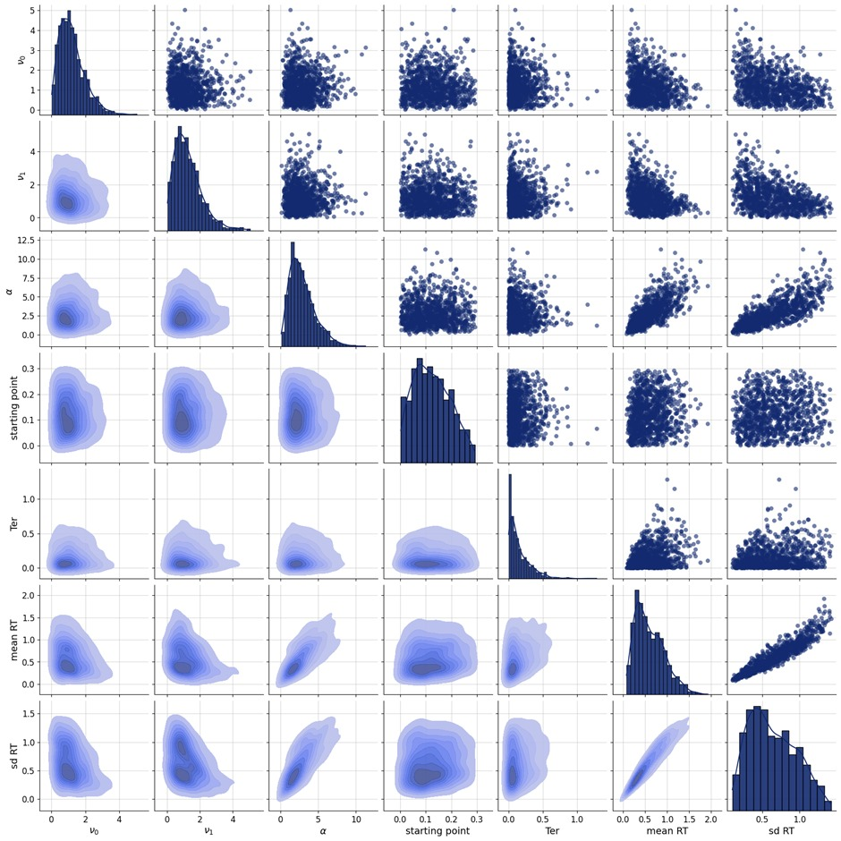
```

## Results (RDM)
<br>
```{r, echo=F, out.width="100%", fig.align="center"}
library(knitr)
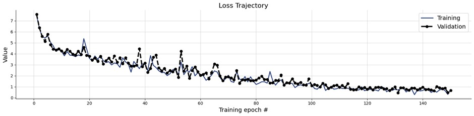
```

## Results (RDM)
<br>
```{r, echo=F, out.width="100%", fig.align="center"}
library(knitr)
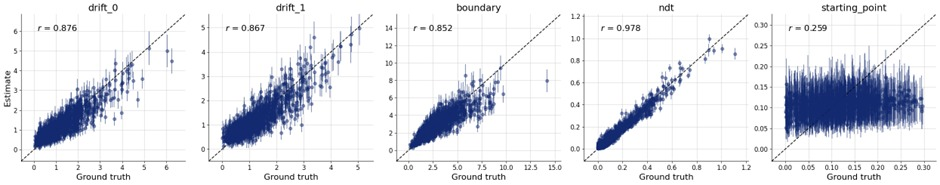
```

## Results (RDM)
<br>
```{r, echo=F, out.width="100%", fig.align="center"}
library(knitr)
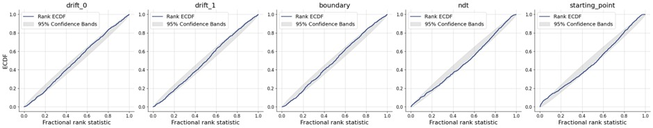
```

## Results (RDM)
<br>
```{r, echo=F, out.width="100%", fig.align="center"}
library(knitr)
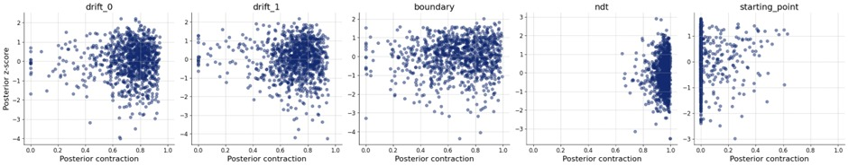
```

## Results (RDM)
<br>
```{r, echo=F, out.width="60%", fig.align="center"}
library(knitr)
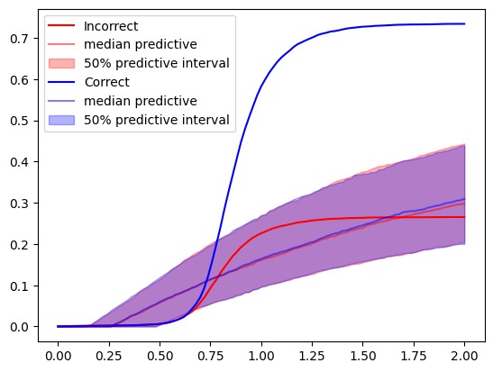
```


## Results (FFI)
<br>
```{r, echo=F, out.width="100%", fig.align="center"}
library(knitr)
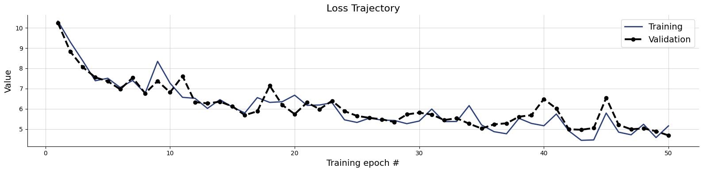
```

## Results (FFI)
<br>
```{r, echo=F, out.width="100%", fig.align="center"}
library(knitr)
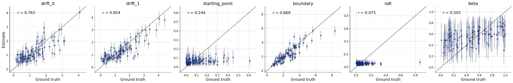
```

## Results (FFI)
<br>
```{r, echo=F, out.width="100%", fig.align="center"}
library(knitr)
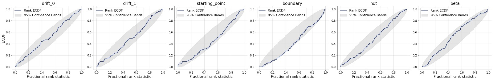
```

## Results (FFI)
<br>
```{r, echo=F, out.width="100%", fig.align="center"}
library(knitr)
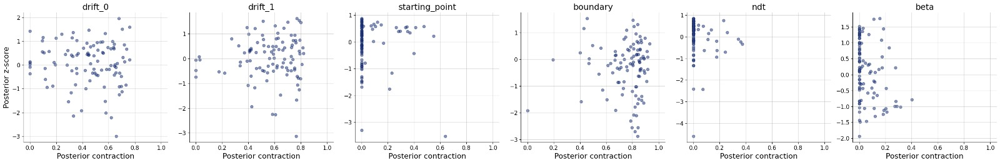
```


## Diagnostics (LCA)
<br>
```{r, echo=F, out.width="100%", fig.align="center"}
library(knitr)
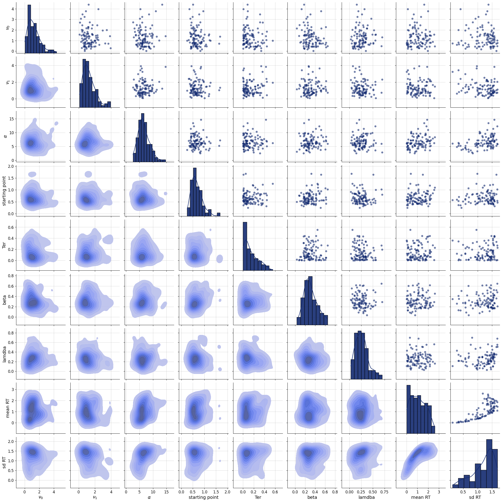
```

## Results (LCA)
<br>
```{r, echo=F, out.width="100%", fig.align="center"}
library(knitr)
include_graphics("LCA(loss).png")
```

## Results (LCA)
<br>
```{r, echo=F, out.width="100%", fig.align="center"}
library(knitr)
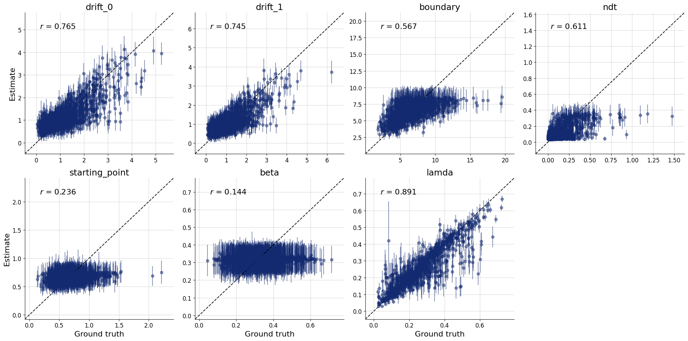
```

## Results (LCA)
<br>
```{r, echo=F, out.width="100%", fig.align="center"}
library(knitr)
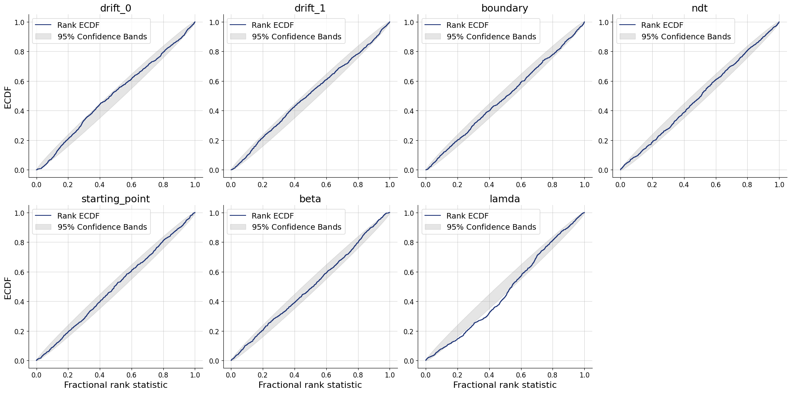
```

## Results (LCA)
<br>
```{r, echo=F, out.width="100%", fig.align="center"}
library(knitr)
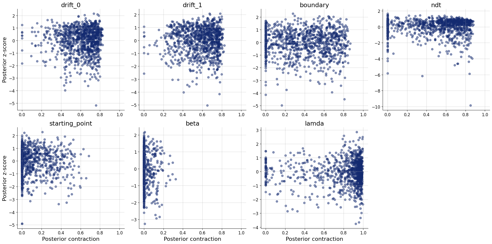
```

## Results (LCA)
<br>
```{r, echo=F, out.width="100%", fig.align="center"}
library(knitr)
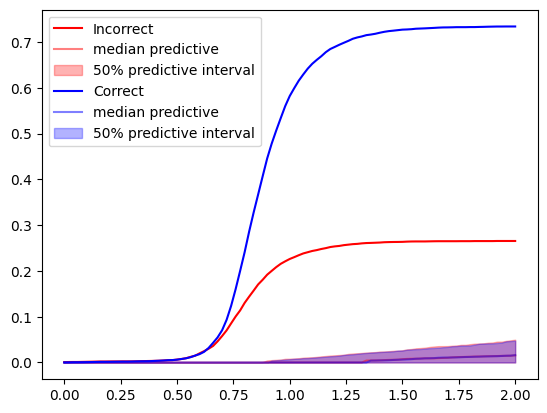
```

## Key Findings
Adding double response did kind of lead to the model to learn more

RDM
```{r, echo=F, fig.align="center", out.width= "65%"}
library(knitr)

```

FFI
```{r, echo=F, out.width="65%", fig.align="center"}
library(knitr)

```

LCA
```{r, echo=F, fig.align="centre", out.width= "70%"}
library(knitr)

```

## Key Findings
It also kind of improved the posterior contraction 

RDM
```{r, echo=F, fig.align="center", out.width= "70%"}
library(knitr)

```

FFI
```{r, echo=F, out.width="80%", fig.align="center"}
library(knitr)

```

LCA
```{r, echo=F, fig.align="center", out.width= "70%"}
library(knitr)

```

## Limitations of our model
- ⁠Priors can be more grounded in theory
  
- ⁠More participants, more double response


<b>Accuracy Participant 2 </b><br>
```{r, echo=F, results='asis'}
library(knitr)
kable(readRDS("a1dr.RDS"), align = "cccc")

```


## Directions for Future Research
  - Study design $\rightarrow$ explicit double responses 
  
  - Alternative definition of double response $\rightarrow$ loser drift over takes winner drift

```{r, echo=F, fig.align="center", out.width= "50%"}
library(knitr)
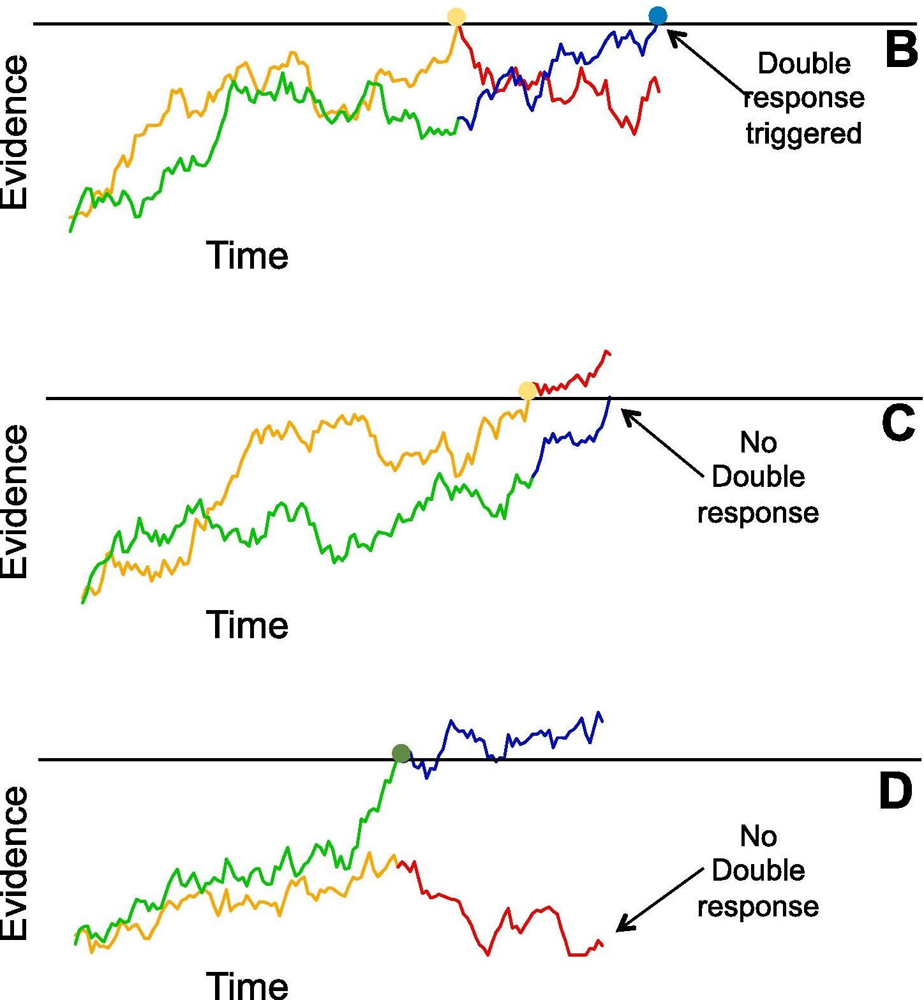
```


# Thanks for listening <3
